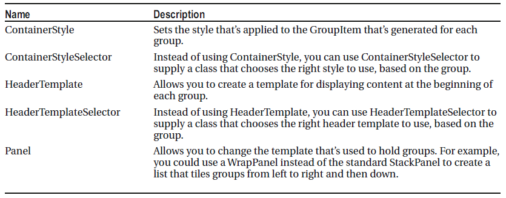

# CollectionViewSource

`CollectionView` objects are always created when binding a list to a `ItemsControl`, but normally you don't have to use it explicitly. Use `CollectionViewSource` as a factory that fetches the default view of a list to sort, filter or group items.

The view object that’s used depends on the type of data object. All views derive from `CollectionView`, but two specialized implementations derive from `CollectionView`: `ListCollectionView` and `BindingListCollectionView`:

- If your data source implements `IBindingList`, a `BindingListCollectionView` is created. This happens when you bind an ADO.NET `DataTable`.
- If your data source doesn’t implement `IBindingList` but it implements` IList`, a `ListCollectionView` is created. This happens when you bind an `ObservableCollection`, like the list of products.
- If your data source doesn’t implement `IBindingList` or`IList` but it implements `IEnumerable`, you get a basic `CollectionView`.


To fetch the default view:

```csharp
ICollectionView view = CollectionViewSource.GetDefaultView(lstProducts.ItemsSource);
```

To change the view current item:

```csharp
view.MoveCurrentTo(lstProducts.SelectedItem);
```

## Sorting

```xml
xmlns:scm="clr-namespace:System.ComponentModel;assembly=WindowBase"

<Window.Resources>
    <CollectionViewSource x:Key="cvsActors" Source="{Binding ActorList}" >
        <CollectionViewSource.SortDescriptions>
            <scm:SortDescription PropertyName="LastName" />
        </CollectionViewSource.SortDescriptions>
    </CollectionViewSource>
</Window.Resources>


<StackPanel>
    <ListBox Name="lbActors" Margin="15" Width="200" Height="190"
            ItemsSource="{Binding Source={StaticResource cvsActors}}"/>
</StackPanel>
```

You also can perform a custom sort, but only if you’re using the `ListCollectionView` (not the `BindingListCollectionView`). The `ListCollectionView` provides a `CustomSort` property that accepts an IComparer object that performs the comparison between any two data items and indicates which one should be considered greater than the other.

```csharp
public class SortByModelNameLength : System.Collections.IComparer
{
    public int Compare(object x, object y)
    {
        Product productX = (Product)x;
        Product productY = (Product)y;
        return productX.ModelName.Length.CompareTo(productY.ModelName.Length);
    }
}

ListCollectionView view = (ListCollectionView)CollectionViewSource.GetDefaultView(lstProducts.ItemsSource);
view.CustomSort = new SortByModelNameLength();
```

## Grouping

```xml
<Window.Resources>
    <CollectionViewSource x:Key="cvsActors" Source="{Binding ActorList}" >
        <CollectionViewSource.SortDescriptions>
            <scm:SortDescription PropertyName="DecadeBorn" />
            <scm:SortDescription PropertyName="LastName" />
        </CollectionViewSource.SortDescriptions>
        <CollectionViewSource.GroupDescriptions>
            <data:PropertyGroupDescription  PropertyName="DecadeBorn"/>
        </CollectionViewSource.GroupDescriptions>
    </CollectionViewSource>
</Window.Resources>


<StackPanel>
    <ListBox Name="lbActors" Margin="15" Width="200" Height="240"
            ItemsSource="{Binding Source={StaticResource cvsActors}}">
        <ListBox.GroupStyle>
            <GroupStyle>
                <GroupStyle.ContainerStyle>
                    <Style TargetType="{x:Type GroupItem}">
                        <Setter Property="Template">
                            <Setter.Value>
                                <ControlTemplate>
                                    <Expander Header="{Binding Name}" IsExpanded="True">
                                        <ItemsPresenter />
                                    </Expander>
                                </ControlTemplate>
                            </Setter.Value>
                        </Setter>
                    </Style>
                </GroupStyle.ContainerStyle>
            </GroupStyle>
        </ListBox.GroupStyle>
    </ListBox>
</StackPanel>
```

Or programmatically:

```csharp
ICollectionView view = CollectionViewSource.GetDefaultView(lstProducts.ItemsSource);
view.GroupDescriptions.Add(new PropertyGroupDescription("CategoryName"));
```

Properties of GroupStyle class:




Note that when you bind to the group header you aren't binding to the data object in the collection, you're binding to the PropertyGroupDescription object. If you want to bind to the field value for the group, you need to bind to PropertyGroupDescription.Name.

You can also use an IValueConverter for advanced grouping

```csharp
ICollectionView view = CollectionViewSource.GetDefaultView(lstProducts.ItemsSource);
view.SortDescriptions.Add(new SortDescription("UnitCost", ListSortDirection.Ascending));
PriceRangeProductGrouper grouper = new PriceRangeProductGrouper();
grouper.GroupInterval = 50;
view.GroupDescriptions.Add(new PropertyGroupDescription("UnitCost", grouper));
```

And the converter

```csharp
public class PriceRangeProductGrouper : IValueConverter
{
    public int GroupInterval
    {
        get;
        set;
    }

    public object Convert(object value, Type targetType, object parameter, CultureInfo culture)
    {
        decimal price = (decimal)value;
        if (price < GroupInterval)
        {
            return String.Format("Less than {0:C}", GroupInterval);
        }
        else
        {
            int interval = (int)price / GroupInterval;
            int lowerLimit = interval * GroupInterval;
            int upperLimit = (interval + 1) * GroupInterval;               
            return String.Format("{0:C} to {1:C}", lowerLimit, upperLimit);
        }           
    }

    public object ConvertBack(object value, Type targetType, object parameter, CultureInfo culture)
    {
        throw new NotSupportedException("This converter is for grouping only.");
    }
}
```

To make sure virtualization still works when grouping:

```csharp
<ListBox VirtualizingStackPanel.IsVirtualizingWhenGrouping="True" ...
```

## Filtering

```xml
<Window.Resources>
    <CollectionViewSource x:Key="cvsActors" Source="{Binding ActorList}" >
        <CollectionViewSource.SortDescriptions>
            <scm:SortDescription PropertyName="LastName" />
        </CollectionViewSource.SortDescriptions>
    </CollectionViewSource>
</Window.Resources>


<StackPanel>
    <ListBox Name="lbActors" Margin="15" Width="200" Height="200"
            ItemsSource="{Binding Source={StaticResource cvsActors}}"/>
    <CheckBox Content="Only Joans" IsChecked="{Binding OnlyJoans}"
              Margin="15"/>
</StackPanel>
```

In code, we add a handler for the Filter event of the CollectionViewSource. The handler is called for each item in the list.

```csharp
// Requires: using System.Windows.Data
((CollectionViewSource)this.Resources["cvsActors"]).Filter += ActorList_Filter;
```

In the handler, we set the Accepted property of the argument if the item should be included in the list.

```csharp
void ActorList_Filter(object sender, FilterEventArgs e)
{
  // Set e.Accepted to true to include the item in the list
  if (!onlyJoans)
      e.Accepted = true;
  else
  {
      Actor a = e.Item as Actor;
      e.Accepted = (a.FirstName == "Joan") ? true : false;
  }
}
```

We also have to make sure to “refresh” the CollectionViewSource when the OnlyJoans property changes. This will trigger it to re-filter the collection.

```csharp
private bool onlyJoans;
public bool OnlyJoans
{
  get { return onlyJoans; }
  set
  {
      if (value != onlyJoans)
      {
          onlyJoans = value;
          RaisePropertyChanged("OnlyJoans");
          ((CollectionViewSource)this.Resources["cvsActors"]).View.Refresh();
      }
  }
}
```

## Live Sorting
By default, when you’re using a CollectionViewSource to do sorting, grouping and filtering in a list-based control, the sorting/grouping/filtering behavior will only updated when you explicitly refresh the CollectionViewSource (by calling Refresh) or when you add or remove something to the collection.

You can enable live sorting in the CollectionViewSource to cause it to resort items when one or more properties on the bound objects change. In the example below, we set the IsLiveSortingRequested property to true and specify that the Actor.LastName property is the property to live sort on. Now when we make a change to the last name of one of the actors, the sorting is updated.

Note that the data object being bound to must implement INotifyPropertyChanged.

```xml
<Window.Resources>
    <CollectionViewSource x:Key="cvsActors" Source="{Binding ActorList}"
                          IsLiveSortingRequested="True">
        <CollectionViewSource.LiveSortingProperties>
            <clr:String>LastName</clr:String>
        </CollectionViewSource.LiveSortingProperties>
        <CollectionViewSource.SortDescriptions>
            <scm:SortDescription PropertyName="LastName" />
        </CollectionViewSource.SortDescriptions>
    </CollectionViewSource>
</Window.Resources>
```

## Live Filtering
Like sorting, filtering in a CollectionViewSource is not automatically done when you change the contents of one of the data bound items. By default, you need to call the Refresh method of the CollectionViewSource. You can fix this by adding the FirstName property to the LiveFilteringProperties collection of the CollectionViewSource and setting IsLiveFilteringRequested to true.

```xml
<CollectionViewSource x:Key="cvsActors" Source="{Binding ActorList}"
                      IsLiveFilteringRequested="True">
    <CollectionViewSource.LiveFilteringProperties>
        <clr:String>FirstName</clr:String>
    </CollectionViewSource.LiveFilteringProperties>
    <CollectionViewSource.SortDescriptions>
        <scm:SortDescription PropertyName="LastName" />
    </CollectionViewSource.SortDescriptions>
</CollectionViewSource>
```
<!--stackedit_data:
eyJoaXN0b3J5IjpbLTQyOTY1NDkyOSwxNjE0NDQ1ODFdfQ==
-->