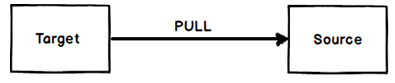
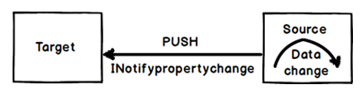

# INotifyPropertyChanged

When we bind two WPF objects the target data is updated depending on the `UpdateSourceTrigger` events. Please refer the previous question for `UpdateSourceTrigger` basics.
The `UpdateSourceTrigger` has events like lostfocus , property change etc. In other words when lostfocus or property change event happen on the target it makes a PULL to the source to get the latest data.



So it’s very much possible that the WPF source data has changed and because the WPF target `UpdateSourceTrigger` event did not fire he did not make a pull and the data of the source is not in sync with the target. This is where `INotifyPropertyChanged` interface comes to use.



Below is a simple `clsCounter` class which has a `Counter` property and this property is incremented by `Increment` method.

Now if we bind WPF label or textbox to the `Counter` property and call the `Increment` method the new `Counter` value will not be propagated to the target. Because invoking a method does not trigger any `UpdateSourceTrigger` event.

So after calling the `Increment` method the `Counter` value of the source and the target are out of sync.

So create a push event from the source you need to first implement `INotifyPropertyChanged` interface as shown in the below figure. Now when someone calls the `Increment` method you can raise an event saying that the `Counter` property has changed by calling `PropertyChanged` function as shown in the below code.

In simple words the source sends a notification to the target WPF object that data has changed in the source and he should refresh himself with the fresh data.

```csharp
public class clsCounter : INotifyPropertyChanged
{

        private int _Counter=0;

        public int Counter
        {
            get { return _Counter; }
        }

        public void Increment()
        {
            _Counter++;
            PropertyChanged(this, new PropertyChangedEventArgs("Counter"));
        }


        public event PropertyChangedEventHandler PropertyChanged;
  }
```
<!--stackedit_data:
eyJoaXN0b3J5IjpbLTE4NTc1MTM1NTUsNDMxMzQ2MjUsLTk2Mj
M1NzE2MV19
-->