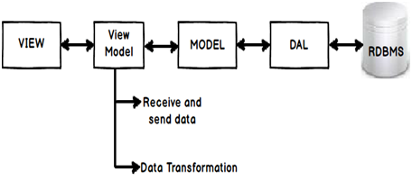

# MVVM

Benefits:
- Separation of concern
- Increased UI reusability - one view can be used for multiple view models.
- Easier to test

<!--stackedit_data:
eyJoaXN0b3J5IjpbLTE2MzcyMTg4MSw3MTM5NjU5MDJdfQ==
-->