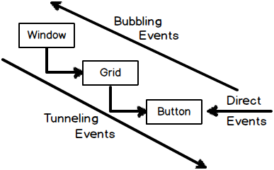

# Routed Events

Routed events travel up and down the visual tree hierarchy. The Visual tree hierarchy is the logical XAML tree hierarchy that has been converted into the objects that are displayed on the screen. Routed events invoke handlers on multiple listeners in an element tree, rather than just on the object that raised the event. They are CLR events that are backed by an instance of the `RoutedEvent` class and is processed by the WPF event system.

There are three types of WPF events:
- Direct events: event is raised by the source and handled at the source, like `MouseEnter` events.
- Bubbling events: events that travel up the visual tree hierarchy looking for handlers, e.g.` MouseDown` is a bubbling event.
- Tunneling events: events that travel down the visual tree hierarchy looking for handlers . e.g. `PreviewKeyDown`.



https://wpftutorial.net/RoutedEvents.html

```xml
<Window x:Class="WpfApp1.MainWindow"
        xmlns="http://schemas.microsoft.com/winfx/2006/xaml/presentation"
        xmlns:x="http://schemas.microsoft.com/winfx/2006/xaml"
        xmlns:d="http://schemas.microsoft.com/expression/blend/2008"
        xmlns:mc="http://schemas.openxmlformats.org/markup-compatibility/2006"
        xmlns:local="clr-namespace:WpfApp1"
        mc:Ignorable="d"
        Title="MainWindow" Height="350" Width="525"
        ButtonBase.Click  = "Window_Click">

<Window.Resources>

</Window.Resources>

    <Grid>
        <StackPanel Margin = "20" ButtonBase.Click = "StackPanel_Click">

            <StackPanel Margin = "10">
                <TextBlock Name = "txt1" FontSize = "18" Margin = "5" Text = "This is a TextBlock 1" />
                <TextBlock Name = "txt2" FontSize = "18" Margin = "5" Text = "This is a TextBlock 2" />
                <TextBlock Name = "txt3" FontSize = "18" Margin = "5" Text = "This is a TextBlock 3" />
            </StackPanel>

            <Button Margin = "10" Content = "Click me" Click = "Button_Click" Width = "80"/>
        </StackPanel>
    </Grid>
</Window>
```

```csharp
public partial class MainWindow : Window
{
    public MainWindow()
    {
        InitializeComponent();
    }

    private void Button_Click(object sender, RoutedEventArgs e)
    {
        txt1.Text = "Button is Clicked";
    }

    private void StackPanel_Click(object sender, RoutedEventArgs e)
    {
        txt2.Text = "Click event is bubbled to Stack Panel";
    }

    private void Window_Click(object sender, RoutedEventArgs e)
    {
        txt3.Text = "Click event is bubbled to Window";
    }
}
```

To create a custom routed event:

```csharp
// Register the routed event
public static readonly RoutedEvent SelectedEvent =
    EventManager.RegisterRoutedEvent("Selected", RoutingStrategy.Bubble,
    typeof(RoutedEventHandler), typeof(MyCustomControl));

// .NET wrapper
public event RoutedEventHandler Selected
{
    add { AddHandler(SelectedEvent, value); }
    remove { RemoveHandler(SelectedEvent, value); }
}

// Raise the routed event "selected"
RaiseEvent(new RoutedEventArgs(MyCustomControl.SelectedEvent));
```
<!--stackedit_data:
eyJoaXN0b3J5IjpbLTU5NDkzMDcxNSw5ODg0MTMwODgsOTMwMj
E5NTAyXX0=
-->