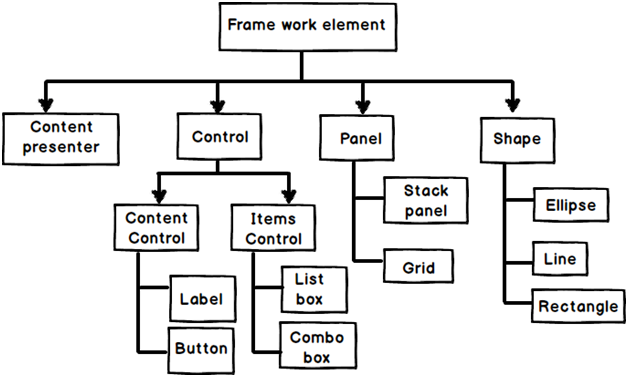
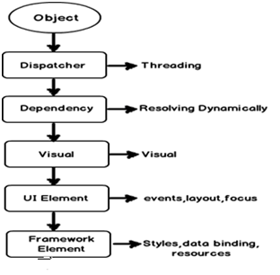
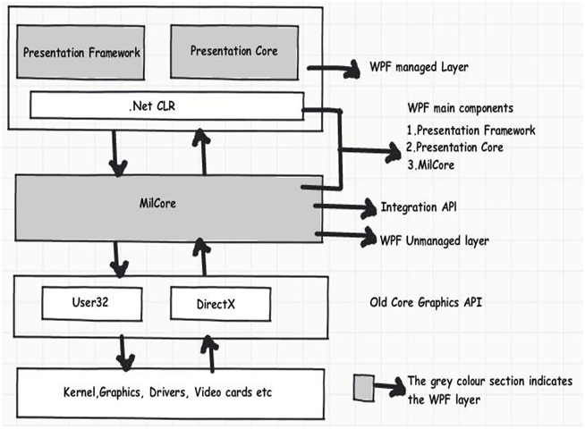

# WPF Intro


- Binding
- Resources and Styles - reusable
- Declarative - XAML
- Animation easy
- Hardware acceleration
- Resolution independent

`xmlns` stands for Xml namespaces

This is the default namespace and helps to resolve overall WPF elements:

```xml
xmlns="http://schemas.microsoft.com/winfx/2006/xaml/presentation"
```

This helps to resolve the language definition:

```xml
xmlns:x="http://schemas.microsoft.com/winfx/2006/xaml"
```

So this `StackPanel` is resolved from the default namespace and the name attribute comes from the `xmlns:x` declaration:

```xml
<StackPanel x:Name="myStack" />
```

`x:name` and `name` are the same - but sometimes you need to use `x:name` to get it to work


## WPF Control Categories

WPF controls can be categorized in to four categories:-
- Control: - This is the basic control with which you will work most of time. For example `TextBox`, `Button` etc. Now controls which are standalone control like button , text box , labels etc are termed as content control. Now there are other controls which can hold other controls, for instance `itemscontrol`. `Itemscontrol` can have multiple `textbox` controls, label controls etc.
- Shape: - These controls help us to create simple graphic controls like ellipse, line, rectangle etc.
- Panel: - These controls help to align and position the controls. For instance grid helps us to align in a table manner, stack panel helps for horizontal and vertical alignment.
- Content presenter: - This control helps to place any XAML content inside it. Used when we want to add dynamic controls on a WPF screen.




## WPF Object Hierarchy



- `Object`: - As WPF is created using .NET so the first class from which WPF UI classes inherits is the .NET object class.
- `Dispatcher:` - This class ensures that all WPF UI objects can be accessed directly only by the thread who own him. Other threads who do not own him have to go via the dispatcher object.
- `Dependency`: - WPF UI elements are represented by using XAML which is XML format. At any given moment of time a WPF element is surrounded by other WPF elements and the surrounded elements can influence this element and this is possible because of this dependency class. For example if a textbox surrounded by a panel, its very much possible that the panel background color can be inherited by the textbox.
- `Visual`: - This is the class which helps WPF UI to have their visual representation.
- `UIElement`: - This class helps to implement features like events, input, layouting etc.
- `Framework element`: - This class supports for templating , styles , binding , resources etc.
- And finally all WPF controls `textbox` , `button` , `grid` and whatever you can think of from the WPF tool box inherits from the framework element class.

## WPF Architecture



- User32:- It decides which goes where on the screen.
- DirectX: - As said previously WPF uses directX internally. DirectX talks with drivers and renders the content.
- Milcore: - Mil stands for media integration library. This section is a unmanaged code because it acts like a bridge between WPF managed and DirectX / User32 unmanaged API.
- Presentation core :- This is a low level API exposed by WPF providing features for 2D , 3D , geometry etc.
- Presentation framework:- This section has high level features like application controls , layouts . Content etc which helps you to build up your application.

## App.xaml

App.xaml is the start up file or a boot strapper file which triggers your first XAML page from your WPF project.


## Panels

- `Grid`
- `StackPanel`
- `WrapPanel`
- `DockPanel`
- `Canvas`

### DockPanel

```xml
<DockPanel>
<Label DockPanel.Dock="Top" Height="100" Background="Red">Top 1</Label>
<Label DockPanel.Dock="Left" Background="LightGreen">Left</Label>
<Label DockPanel.Dock="Right" Background="LightCyan">Right</Label>
<Label DockPanel.Dock="Bottom" Background="LightBlue">Bottom</Label>
<TextBlock VerticalAlignment="Center" HorizontalAlignment="Center"> Demo of Dock panel</TextBlock>
</DockPanel>
```

### Canvas

```xml
<Canvas>
     <Button Canvas.Left="10">Top left</Button>
     <Button Canvas.Right="10">Top right</Button>
     <Button Canvas.Left="10" Canvas.Bottom="10">Bottom left</Button>
     <Button Canvas.Right="10" Canvas.Bottom="10">Bottom right</Button>
</Canvas>
```
<!--stackedit_data:
eyJoaXN0b3J5IjpbMTc0Mzk4NDkxMiwxNzkyODc4NTk5LC03Nz
M5NDI4NDJdfQ==
-->